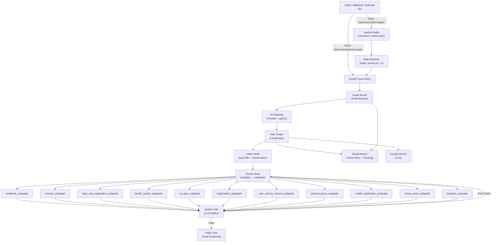

# 🌐 Aurora Agent — iGOT Karmayogi Ticket Resolution System

> **Aurora Agent** is an agentic AI backend built on **LangGraph** and **Google Gemini** that automates L1 support ticket resolution for the [iGOT Karmayogi](https://igot.gov.in) platform. It classifies incoming user issues, injects category-specific Standard Operating Procedures (SOPs) into system prompts, executes multi-step resolution flows using specialist API tools, and escalates to human specialists when required.

[](https://python.org)
[](https://fastapi.tiangolo.com)
[](https://langchain-ai.github.io/langgraph/)

---

## 📋 Table of Contents

- [Key Features](#-key-features)
- [Architecture](#️-architecture)
- [Directory Structure](#-directory-structure)
- [Databases & External Services](#-databases--external-services)
- [Ticket Category Taxonomy](#️-ticket-category-taxonomy)
- [API Reference](#-api-reference)
- [Environment Variables](#️-environment-variables)
- [Local Development Setup](#-local-development-setup)
- [Docker Deployment](#-docker-deployment)
- [Running Tests](#-running-tests)
- [Developer Guide](#️-developer-guide)
- [Security Considerations](#-security-considerations)

---

## ✨ Key Features

| Feature | Description |
|---|---|
| **Agentic Multi-Step Resolution** | LangGraph state machines drive autonomous `plan → execute → decide` loops per ticket category |
| **Embedded SOP Workflows** | Resolves issues using embedded domain SOPs directly in structured prompt templates |
| **11-Category Taxonomy** | Routes tickets across certificate, course, login, profile, CA/APAR, organisation, and more |
| **Quality Gate Auditor** | LLM-based auditor checks final responses for quality; auto-retries on failure |
| **Continuation Support** | Resumes multi-turn conversation threads using persistent ElasticSearch ticket state |
| **PII Masking** | Presidio-based PII detection and anonymisation on all inbound messages |
| **Async Kafka Ingestion** | Kafka-backed async queue for high-throughput ticket ingestion with concurrent workers |
| **Centralized Prompts** | All LLM prompts consolidated in `prompt_templates.py` for easy tuning |
| **Structured Logging** | Python `logging` module throughout — no raw `print()` statements in production flows |
| **Pydantic Settings** | Type-safe, validated environment config via `pydantic-settings` |

---

## 🏗️ Architecture

### High-Level System Diagram



### Resolution Flow (per subgraph)

Each category subgraph runs a **plan → execute → decide** loop (up to `max_retries = 3`):

```
plan_node → execute_node → decide_node → [ resolved | needs_clarification | escalate | retry → plan_node ]
```

| Node | Responsibility |
|---|---|
| **plan_node** | Evaluates current state against embedded SOP rules; selects tool calls or response strategy |
| **execute_node** | Invokes specialist tools (iGOT platform APIs, profile checks, enrollment queries) |
| **decide_node** | Classifies outcome: `resolved` / `needs_clarification` / `escalate` / `retry` |

---

## 📂 Directory Structure

```text
aurora-agent/
├── app/
│   ├── api/
│   │   └── health/                  # Health check endpoints (/api/v1/health)
│   ├── core/
│   │   ├── graph/
│   │   │   ├── main_graph.py        # LangGraph main graph orchestrator
│   │   │   ├── graph_router.py      # FastAPI router — ticket processing & tracking endpoints
│   │   │   ├── ticket_store.py      # ElasticSearch ticket CRUD operations & thread state
│   │   │   ├── state.py             # TicketState TypedDict (shared graph state)
│   │   │   ├── nodes/
│   │   │   │   ├── intake_node.py   # Early validation, junk detection, issue classification
│   │   │   │   └── router_node.py   # Category-to-subgraph router node
│   │   │   └── subgraphs/
│   │   │       ├── base_subgraph.py # Generic plan/execute/decide loop base class
│   │   │       ├── certificate_subgraph.py
│   │   │       ├── courses_subgraph.py
│   │   │       ├── login_and_registration_subgraph.py
│   │   │       ├── profile_update_subgraph.py
│   │   │       ├── ca_apar_subgraph.py
│   │   │       ├── organisation_subgraph.py
│   │   │       ├── user_service_request_subgraph.py
│   │   │       ├── general_query_subgraph.py
│   │   │       ├── mobile_application_subgraph.py
│   │   │       ├── virtual_event_subgraph.py
│   │   │       └── program_subgraph.py
│   │   ├── tools/
│   │   │   ├── certificate_tools.py   # Certificate status & verification tools
│   │   │   ├── course_tools.py        # Course progress & enrollment tools
│   │   │   ├── login_issue_tool.py    # Account lookup & email domain validation tools
│   │   │   ├── profile_update_tool.py # Profile verification & MDO SPOC tools
│   │   │   ├── stub_tools.py          # Minimal tool definitions for stub subgraphs
│   │   │   ├── ticket_tools.py        # Human escalation & quality gate utility functions
│   │   │   └── zoho_tools.py          # Zoho Desk integration tools
│   │   └── utils/
│   │       ├── config.py              # Pydantic BaseSettings config loader
│   │       ├── constants.py           # Feature flags, stage definitions, LLM model mapping
│   │       ├── prompt_templates.py    # Embedded SOP system prompts (single source of truth)
│   │       ├── es_utils.py            # ElasticSearch client singleton manager
│   │       ├── helpers.py             # YP/MDO CSV allocation lookup & junk detection helpers
│   │       ├── kafka_queue.py         # Async Kafka producer and consumer helpers
│   │       ├── pii_masker.py          # Presidio-based PII masker
│   │       ├── ticket_tracker.py      # Ticket lifecycle stage tracker (ES)
│   │       └── token_tracker.py       # LLM token usage tracker (ES)
│   └── services/
│       ├── igot_service.py            # iGOT platform API integration service
│       └── zoho_service.py            # Zoho Desk API & OAuth token service
├── tests/
│   ├── conftest.py                    # Pytest fixtures & environment setup
│   ├── test_graph_and_subgraphs.py    # End-to-end main graph & subgraph integration tests
│   ├── test_ingest_apis.py            # Rest API & async ingest endpoint tests
│   ├── test_pii_masking.py            # Presidio PII masking unit tests
│   ├── test_intake_node.py            # Intake node unit tests
│   ├── test_router_node.py            # Router node unit tests
│   ├── test_subgraphs.py              # Subgraph execution unit tests
│   ├── test_ticket_store.py           # ElasticSearch ticket store unit tests
│   └── test_quality_gate.py           # Quality gate auditor tests
├── main.py                            # FastAPI application entry point
├── kafka_worker.py                    # Background Kafka ticket processing worker
├── seed_tickets.py                    # Helper script to populate test tickets into API/Kafka
├── start_combined.sh                  # Shell script for dual-process startup (API + Workers)
├── Dockerfile                         # Multi-stage Docker production build file
├── requirements.txt                   # Pinned Python dependency list
├── .env.example                       # Environment variable config template
└── .gitignore
```

---

## 🗄️ Databases & External Services

| Service | Purpose | Recommended Version |
|---|---|---|
| **ElasticSearch** | Primary datastore for ticket interactions, stage tracking, and token usage | 8.0+ |
| **Apache Kafka** | Asynchronous queue for ticket ingestion and load balancing | 3.0+ |
| **Google Gemini** | LLM for classification, multi-step planning, and response generation | `gemini-2.5-flash` / `gemini-3.5-flash` |
| **iGOT Platform API** | Platform API for retrieving user profiles, course state, and enrollments | — |
| **Zoho Desk** | Optional external CRM ticketing system integration | — |

---

## 🗂️ Ticket Category Taxonomy

| Category Key | Common Issues | Subgraph Implementation |
|---|---|---|
| `certificate` | Certificate missing, not generated, download error | `certificate_subgraph` |
| `course` | Course progress stuck, enrollment issue, assessment error | `courses_subgraph` |
| `program` | Program-level assessment issues | `program_subgraph` |
| `login_issue` | Unable to login, password reset, account verification | `login_and_registration_subgraph` |
| `profile_update` | Verification badge, designation update, leaderboard | `profile_update_subgraph` |
| `user_service_request` | Account activation/deactivation, department transfer | `user_service_request_subgraph` |
| `ca_apar_issue` | APAR training plan, SPARROW data sync | `ca_apar_subgraph` |
| `organisation_request` | Add domain request, MDO channel creation | `organisation_subgraph` |
| `mobile_application` | Mobile app failing to load or crash | `mobile_application_subgraph` |
| `virtual_event` | Unable to join or search virtual event | `virtual_event_subgraph` |
| `general` | General query / need information | `general_query_subgraph` |

---

## 🔌 API Reference

### Health Check Endpoints

| Method | Path | Description |
|---|---|---|
| `GET` | `/api/v1/health` | Basic service liveness check |
| `GET` | `/api/v1/health/detail` | Detailed check for ElasticSearch connectivity |

### Resolution & Ticket Management Endpoints

| Method | Path | Description |
|---|---|---|
| `POST` | `/api/v1/resolution/process` | **Synchronous**: Process ticket through LangGraph and return response |
| `POST` | `/api/v1/resolution/ingest` | **Asynchronous**: Publish ticket to Kafka queue for background execution |
| `GET` | `/api/v1/resolution/tracking` | Paginated ticket stage tracking metrics |
| `GET` | `/api/v1/resolution/tracking/{ticket_id}` | Detailed lifecycle tracking history for a specific ticket |
| `GET` | `/api/v1/resolution/token-usage` | Token consumption logs across tickets |
| `GET` | `/api/v1/resolution/token-usage/stats` | Aggregated token usage metrics |
| `GET` | `/api/v1/resolution/tickets` | Retrieve stored resolution tickets from ElasticSearch |

#### Synchronous Endpoint (`POST /api/v1/resolution/process`) Example Request

```json
{
  "email": "user@gov.in",
  "message": "I completed my course yesterday but the certificate is not generated."
}
```

#### Example Response

```json
{
  "ticket_id": "8f3b2d10-4e5a-4b2c-8a1d-7e9f0c2b4a6d",
  "email": "user@gov.in",
  "status": "resolved",
  "category": "certificate",
  "main_category": "certificate",
  "route_to": "certificate_subgraph",
  "final_response": "Hi User,\n\nGreetings from Karmayogi Bharat Support.\n\nYour certificate request has been processed. Please check your iGOT dashboard under My Certificates to download it.\n\nRegards,\nSupport Team\nKarmayogi Bharat",
  "created_at": "2026-08-05T12:00:00Z"
}
```

---

## ⚙️ Environment Variables

Copy `.env.example` to `.env` and fill in required keys:

```bash
cp .env.example .env
```

| Environment Variable | Required | Default Value | Description |
|---|---|---|---|
| `GOOGLE_API_KEY` | **Yes** | — | Google Gemini API key |
| `IGOT_KEY` | **Yes** | — | iGOT Platform API Bearer token |
| `IGOT_API_HOST_URL` | No | `https://portal.uat.karmayogibharat.net` | iGOT platform API host |
| `ELASTICSEARCH_HOST` | No | — | ElasticSearch cluster URL |
| `ELASTICSEARCH_USERNAME` | No | — | ElasticSearch username |
| `ELASTICSEARCH_PASSWORD` | No | — | ElasticSearch password |
| `ELASTICSEARCH_BOT_INTERACTION_INDEX` | No | `agent_interaction` | Index for ticket interaction state |
| `ELASTICSEARCH_LOGS_INDEX` | No | `application_logs` | Index for application logs |
| `KAFKA_BOOTSTRAP_SERVERS` | No | `localhost:9092` | Kafka broker host & port |
| `KAFKA_TOPIC` | No | `resolution_tickets` | Kafka topic for ticket ingestion |
| `KAFKA_GROUP_ID` | No | `aurora_resolution_workers` | Consumer group ID for workers |
| `ZOHO_CLIENT_ID` | No | — | Zoho Desk OAuth client ID |
| `ZOHO_CLIENT_SECRET` | No | — | Zoho Desk OAuth client secret |
| `ZOHO_REFRESH_TOKEN` | No | — | Zoho Desk OAuth refresh token |
| `ZOHO_ORG_ID` | No | — | Zoho Desk organization ID |
| `VALIDATE_EMAIL` | No | `false` | Enable/disable email domain whitelisting check |
| `RESTRICT_TO_EMAIL_CHANNEL` | No | `false` | Enable/disable channel restriction |

---

## 🚀 Local Development Setup

### 1. Prerequisites

- Python 3.11+
- ElasticSearch instance (8.0+)
- Apache Kafka (for async queueing)
- Google Gemini API key

### 2. Virtual Environment Setup

```bash
python3 -m venv venv
source venv/bin/activate
pip install -r requirements.txt
python -m spacy download en_core_web_sm
```

### 3. Environment Configuration

```bash
cp .env.example .env
# Edit .env with your environment credentials
```

### 4. Running the Web API

```bash
uvicorn main:app --host 0.0.0.0 --port 4020 --reload
```

Interactive API Documentation (Swagger UI): `http://localhost:4020/docs`

### 5. Running Async Kafka Workers

In a separate terminal window:

```bash
source venv/bin/activate
python3 kafka_worker.py --workers 4
```

### 6. Seeding Test Tickets

```bash
python3 seed_tickets.py --file test_tickets.json --delay 2
```

---

## 🐳 Docker Deployment

### Single Container Run

```bash
docker build -t aurora-agent .
docker run -d -p 4020:4020 --env-file .env aurora-agent
```

### Docker Compose Stack

```yaml
version: "3.8"

services:
  aurora-agent:
    build: .
    ports:
      - "4020:4020"
    env_file:
      - .env
    depends_on:
      - kafka
    restart: unless-stopped

  zookeeper:
    image: confluentinc/cp-zookeeper:7.5.0
    environment:
      ZOOKEEPER_CLIENT_PORT: 2181
    restart: unless-stopped

  kafka:
    image: confluentinc/cp-kafka:7.5.0
    ports:
      - "9092:9092"
    environment:
      KAFKA_BROKER_ID: 1
      KAFKA_ZOOKEEPER_CONNECT: zookeeper:2181
      KAFKA_ADVERTISED_LISTENERS: PLAINTEXT://kafka:9092
      KAFKA_OFFSETS_TOPIC_REPLICATION_FACTOR: 1
    depends_on:
      - zookeeper
    restart: unless-stopped
```

Run stack:

```bash
docker compose up -d
```

The production entrypoint script (`start_combined.sh`) automatically launches the FastAPI application and 4 Kafka worker tasks inside the container.

---

## 🧪 Running Tests

The test suite uses **pytest** with mocked external service endpoints.

```bash
# Run all tests
pytest

# Run tests with output logs
pytest -v

# Run specific test suites
pytest tests/test_graph_and_subgraphs.py
pytest tests/test_ingest_apis.py
pytest tests/test_pii_masking.py
```

---

## 🛠️ Developer Guide

### Adding a New Ticket Category

1. Add the category definition and system prompt in `app/core/utils/prompt_templates.py`.
2. Implement the category subgraph in `app/core/graph/subgraphs/<category>_subgraph.py` extending `BaseSubgraph`.
3. Update routing logic in `app/core/graph/nodes/router_node.py` and bind nodes in `app/core/graph/main_graph.py`.
4. Add unit test scenarios in `tests/test_subgraphs.py` and `tests/test_graph_and_subgraphs.py`.

---

## 🔐 Security Considerations

- **PII Protection (Inbound)**: Inbound user queries pass through Presidio PII masking prior to LLM reasoning.
- **PII Protection (Tool Outputs)**: Data returned from external APIs via tools MUST implement the `_spoc_replacements` mapping pattern to strip strict PII (e.g., emails, names, phone numbers) before passing the JSON payload back to the LLM. Raw PII bypassing this pattern in tool outputs will leak into the LLM history. *(Note: `user_id` is explicitly excluded from the PII scope and is permitted in LLM inputs).*
- **Credentials Management**: API keys and tokens are loaded strictly via environment variables.
- **Input Validation**: FastAPI models enforce payload structural validation on all endpoints.
