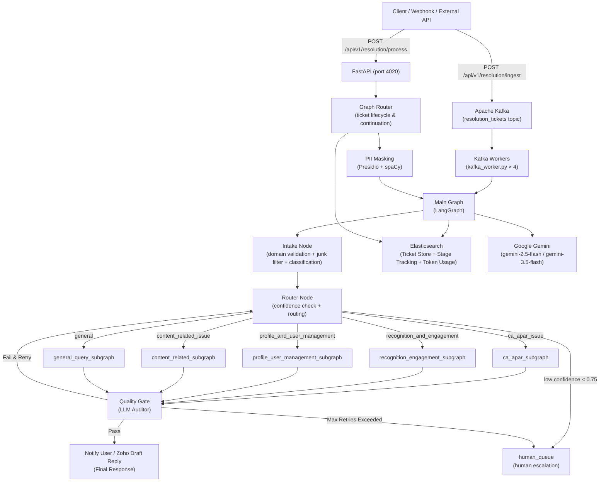

# 🌐 Aurora Agent — iGOT Karmayogi Ticket Resolution System

> **Aurora Agent** is an agentic AI backend built on **LangGraph** and **Google Gemini** that automates L1 support ticket resolution for the [iGOT Karmayogi](https://igot.gov.in) platform. It classifies incoming user issues, injects category-specific Standard Operating Procedures (SOPs) into system prompts, executes multi-step resolution flows using specialist API tools, creates draft responses in Zoho Desk (human-in-the-loop checkpoint), and escalates to human specialists when required.

[](https://python.org)
[](https://fastapi.tiangolo.com)
[](https://langchain-ai.github.io/langgraph/)

---

## 📋 Table of Contents

- [Key Features](#-key-features)
- [Architecture](#️-architecture)
- [Directory Structure](#-directory-structure)
- [Databases & External Services](#-databases--external-services)
- [Ticket Category Taxonomy](#️-ticket-category-taxonomy)
- [API Reference](#-api-reference)
- [Environment Variables](#️-environment-variables)
- [Local Development Setup](#-local-development-setup)
- [Docker Deployment](#-docker-deployment)
- [Running Tests](#-running-tests)
- [Developer Guide](#️-developer-guide)
- [Security Considerations](#-security-considerations)

---

## ✨ Key Features

| Feature | Description |
|---|---|
| **Agentic Multi-Step Resolution** | LangGraph state machines drive autonomous `plan → execute → decide` loops per ticket category |
| **Two-Level SOP Classification** | Hierarchical classification: Category first, followed by Sub-Category with confidence scoring |
| **Subject & Description Prioritization** | Classifies incoming tickets by prioritizing the subject line first, corroborated by the cleaned description |
| **Embedded SOP Workflows** | Resolves issues using domain SOPs injected directly into structured prompt templates |
| **Human-in-the-Loop (HIL) Zoho Drafts** | Automatically prepares draft replies in Zoho Desk for human agent review before dispatching |
| **Quality Gate Auditor** | LLM-based auditor checks drafted responses for adherence to SOP and tone; auto-retries on failure |
| **Continuation Support** | Resumes multi-turn clarification threads using persistent Elasticsearch ticket state (bypassing intake) |
| **PII Masking** | Presidio + spaCy based PII detection and anonymization on all inbound messages |
| **Async Kafka Ingestion** | High-throughput Kafka producer & consumer pool for decoupled background ticket execution |
| **Token & Lifecycle Tracking** | Comprehensive tracking of graph execution stages, duration, and LLM token usage in Elasticsearch |
| **Category Feature Flags** | `ENABLED_CATEGORIES` flag allows selective live rollout of specific SOP workflows |

---

## 🏗️ Architecture

### High-Level System Diagram



### Resolution Flow (per subgraph)

Each category subgraph executes a **plan → execute → decide** loop (up to `max_retries = 3`):

```
plan_node → execute_node → decide_node → [ resolved | needs_clarification | escalate | retry → plan_node ]
```

| Node | Responsibility |
|---|---|
| **plan_node** | Extracts procedural steps from category SOP; determines needed user data and tool call sequence |
| **execute_node** | Invokes tools (iGOT platform APIs, enrollment checks, profile lookup, CA/APAR details) |
| **decide_node** | Formulates HTML draft and selects outcome: `resolved`, `needs_clarification`, `escalate`, or `retry` |

---

## 📂 Directory Structure

```text
aurora-agent/
├── app/
│   ├── api/
│   │   └── health/
│   │       └── router.py              # Health check endpoints (/api/v1/health, /detail)
│   ├── core/
│   │   ├── graph/
│   │   │   ├── main_graph.py          # LangGraph top-level graph orchestrator
│   │   │   ├── graph_router.py        # FastAPI router — ticket processing, tracking & stats
│   │   │   ├── ticket_store.py        # Elasticsearch ticket CRUD operations & conversation state
│   │   │   ├── state.py               # TicketState TypedDict (shared graph state)
│   │   │   ├── nodes/
│   │   │   │   ├── intake_node.py     # Domain check, junk detection, two-level SOP classification
│   │   │   │   └── router_node.py     # Confidence gating & subgraph routing
│   │   │   └── subgraphs/
│   │   │       ├── base_subgraph.py   # Generic plan/execute/decide loop base class
│   │   │       ├── ca_apar_subgraph.py
│   │   │       ├── recognition_engagement_subgraph.py
│   │   │       ├── profile_user_management_subgraph.py
│   │   │       ├── content_related_subgraph.py
│   │   │       └── general_query_subgraph.py
│   │   ├── tools/
│   │   │   ├── ca_apar_tool.py                # CA / APAR plan lookup & assessment tools
│   │   │   ├── recognition_engagement_tools.py# Karma points, claps & learning hours tools
│   │   │   ├── certificate_tools.py           # Certificate verification & status tools
│   │   │   ├── course_tools.py                # Course progress & enrollment tools
│   │   │   ├── login_issue_tool.py            # Account lookup & email domain check tools
│   │   │   ├── profile_update_tool.py         # Profile verification & designation tools
│   │   │   ├── stub_tools.py                  # Support ticket tools for stub subgraphs
│   │   │   ├── ticket_tools.py                # Human escalation & quality gate utility tools
│   │   │   └── zoho_tools.py                  # Zoho Desk integration tools
│   │   └── utils/
│   │       ├── config.py              # Pydantic BaseSettings configuration loader
│   │       ├── constants.py           # Feature flags, stage mappings, model definitions & email templates
│   │       ├── prompt_templates.py    # Embedded SOP system prompts & classification templates
│   │       ├── es_utils.py            # Elasticsearch connection manager singleton
│   │       ├── helpers.py             # Domain check, junk filter, PII masking & user info helpers
│   │       ├── kafka_queue.py         # Async Kafka producer and consumer generators
│   │       ├── pii_masker.py          # Presidio-based PII masker
│   │       ├── ticket_tracker.py      # Ticket lifecycle stage tracker (Elasticsearch)
│   │       └── token_tracker.py       # LLM token usage and latency tracker (Elasticsearch)
│   └── services/
│       ├── igot_service.py            # iGOT platform API client
│       └── zoho_service.py            # Zoho Desk API client & OAuth token service
├── tests/
│   ├── conftest.py                    # Pytest fixtures & environment setup
│   ├── test_graph_and_subgraphs.py    # End-to-end main graph & subgraph integration tests
│   ├── test_ingest_apis.py            # REST API & async ingest endpoint tests
│   ├── test_intake_node.py            # Intake node unit tests (junk, classification, bypass)
│   ├── test_pii_masking.py            # Presidio PII masking unit tests
│   ├── test_quality_gate.py           # Quality gate auditor tests
│   ├── test_router_metrics.py         # Router metrics endpoint tests
│   ├── test_router_node.py            # Router node unit tests
│   ├── test_subgraphs.py              # Subgraph execution unit tests
│   └── test_ticket_store.py           # Elasticsearch ticket store unit tests
├── main.py                            # FastAPI application entry point
├── kafka_worker.py                    # Background Kafka ticket processing worker
├── seed_tickets.py                    # Helper script to populate test tickets into Kafka/API
├── start_combined.sh                  # Dual-process startup script (API + Workers)
├── Dockerfile                         # Multi-stage Docker production build file
├── requirements.txt                   # Pinned Python dependency list
├── .env.example                       # Environment variable configuration template
└── .gitignore
```

---

## 🗄️ Databases & External Services

| Service | Purpose | Recommended Version |
|---|---|---|
| **Elasticsearch** | Datastore for ticket state, multi-turn history, lifecycle tracking, and token usage | 8.0+ |
| **Apache Kafka** | Distributed message queue for asynchronous ticket ingestion and worker dispatch | 3.0+ |
| **Google Gemini** | LLM for classification, multi-step planning, tool reasoning, and quality audit | `gemini-2.5-flash` / `gemini-3.5-flash` |
| **iGOT Platform API** | Platform API for retrieving user profiles, course state, assessments, and enrollments | — |
| **Zoho Desk** | CRM ticketing system (webhook ingestion & automated draft reply creation) | — |

---

## 🗂️ Ticket Category Taxonomy

The classification engine maps incoming tickets into a two-level taxonomy (`CATEGORY_SUBCATEGORY_MAP` in `prompt_templates.py`):

| Category Key | Sub-Categories (Human-Readable Labels) | Subgraph Implementation | Status |
|---|---|---|---|
| **`ca_apar_issue`** | • APAR / Training Plan Not Visible<br>• APAR / Training Plan Unexpected courses visible<br>• APAR / Training Plan - Incorrect Plan Assigned<br>• Comprehensive Assessment Not Visible<br>• Comprehensive Assessment Unable to enroll<br>• Comprehensive Assessment Program (CAP) - Final Assessment Locked | `ca_apar_subgraph` | **Fully Implemented** |
| **`recognition_and_engagement`** | • Karma Points Issue<br>• Weekly Claps Issue<br>• Learning Hours Issue - eHRMS<br>• Learning Hours Issue - Shiksha Path<br>• Learning Hours Issue - SPARROW / APAR<br>• Leader Board Issue | `recognition_engagement_subgraph` | **Fully Implemented** |
| **`profile_and_user_management`** | • Access Revoked<br>• Email / Mobile already registered<br>• Profile Verification / Verified Badge<br>• Designation / Group Not verified<br>• Profile Update | `profile_user_management_subgraph` | **Stub** (Assists via support ticket) |
| **`content_related_issue`** | • Enrolment Issues<br>• Course / Program Progress Issue<br>• Content / Resource Not Opening<br>• Event Related Issue<br>• Certificate Issue<br>• Unable to submit rating/feedback | `content_related_subgraph` | **Stub** (Assists via support ticket) |
| **`general`** | • General query / need information | `general_query_subgraph` | **General Query / Fallback** |

> [!NOTE]
> The `ENABLED_CATEGORIES` feature flag in `constants.py` controls which categories are actively processed. Currently enabled: `["ca_apar_issue", "recognition_and_engagement"]`. Tickets in other categories are gracefully skipped unless `*` is configured.

---

## 🔌 API Reference

### Health Check Endpoints

| Method | Path | Description |
|---|---|---|
| `GET` | `/api/v1/health` | Basic service liveness check |
| `GET` | `/api/v1/health/detail` | Detailed check for Elasticsearch connectivity |

### Resolution & Ingestion Endpoints

| Method | Path | Description |
|---|---|---|
| `POST` | `/api/v1/resolution/process` | **Synchronous**: Process ticket through LangGraph immediately and return final resolution |
| `POST` | `/api/v1/resolution/ingest` | **Asynchronous**: Accept Zoho Desk webhook / API payload, enqueue to Kafka, and return ticket ID |

### Analytics, Tracking & Reporting Endpoints

| Method | Path | Description |
|---|---|---|
| `GET` | `/api/v1/resolution/tickets` | Query stored resolution tickets from Elasticsearch (supports `date_from`, `date_to`, `limit`) |
| `GET` | `/api/v1/resolution/tickets/stats` | Aggregated ticket resolution statistics (resolved vs clarification vs escalated) |
| `GET` | `/api/v1/resolution/tickets/resolution-time-stats` | Turnaround time metrics (avg, min, max resolution duration in seconds) |
| `GET` | `/api/v1/resolution/tickets/agent-stats` | Resolution metrics broken down by category and status |
| `DELETE`| `/api/v1/resolution/tickets/cleanup` | Purge tickets from Elasticsearch within a specified date window |
| `GET` | `/api/v1/resolution/tracking` | Paginated ticket lifecycle tracking stages (`queued`, `in-progress`, `completed`, `failed`) |
| `GET` | `/api/v1/resolution/tracking/{ticket_id}` | Detailed step-by-step audit trail (`graph_plan`) for a specific ticket |
| `GET` | `/api/v1/resolution/token-usage` | Token consumption logs across tickets |
| `GET` | `/api/v1/resolution/token-usage/stats` | Aggregated prompt, completion, and total token usage metrics |
| `GET` | `/api/v1/resolution/token-usage/model-stats` | Token consumption metrics grouped by Gemini model |
| `GET` | `/api/v1/resolution/token-usage/{ticket_id}` | Token consumption breakdown for a single ticket |

#### Synchronous Request Example (`POST /api/v1/resolution/process`)

```json
{
  "id": "104928",
  "email": "officer@gov.in",
  "channel": "Email",
  "message": "My APAR training plan is not visible on the dashboard."
}
```

#### Synchronous Response Example

```json
{
  "status": "completed",
  "ticket_id": "104928",
  "interaction_id": "104928",
  "email": "officer@gov.in",
  "is_continuation": false,
  "is_junk": false,
  "category": "ca_apar_issue",
  "main_category": "ca_apar_issue",
  "confidence": 0.95,
  "route_to": "ca_apar_subgraph",
  "needs_clarification": false,
  "partial_match": false,
  "escalated_to_human": false,
  "escalation_reason": "",
  "final_response": "<html><body><p>Hi Officer,</p><p>Greetings from Karmayogi Bharat Support.</p><div><p>Your APAR training plan for 2025-26 has been identified and verified. Please refresh your dashboard...</p></div><br><p>Regards,<br>Support Team<br>Karmayogi Bharat</p></body></html>",
  "retry_count": 0,
  "quality_passed": true,
  "graph_plan": [
    {
      "node": "intake_node",
      "detail": "Classified as 'ca_apar_issue' / SOP='ca_apar_issue' / sub='APAR / Training Plan Not Visible' (conf=0.95).",
      "timestamp": "14:32:01"
    }
  ]
}
```

---

## ⚙️ Environment Variables

Copy `.env.example` to `.env` and fill in the required values:

```bash
cp .env.example .env
```

| Environment Variable | Required | Default Value | Description |
|---|---|---|---|
| `GOOGLE_API_KEY` | **Yes** | — | Google Gemini API key |
| `IGOT_KEY` | **Yes** | — | iGOT Platform API Bearer token |
| `IGOT_API_HOST_URL` | No | `https://portal.uat.karmayogibharat.net` | iGOT platform API host |
| `ELASTICSEARCH_HOST` | No | — | Elasticsearch cluster URL |
| `ELASTICSEARCH_USERNAME` | No | — | Elasticsearch username |
| `ELASTICSEARCH_PASSWORD` | No | — | Elasticsearch password |
| `ELASTICSEARCH_BOT_INTERACTION_INDEX` | No | `agent_interaction` | Index for ticket interaction state |
| `ELASTICSEARCH_LOGS_INDEX` | No | `application_logs` | Index for application logs |
| `KAFKA_BOOTSTRAP_SERVERS` | No | `localhost:9092` | Kafka broker host & port |
| `KAFKA_TOPIC` | No | `resolution_tickets` | Kafka topic for ticket ingestion |
| `KAFKA_GROUP_ID` | No | `aurora_resolution_workers` | Consumer group ID for workers |
| `ZOHO_CLIENT_ID` | No | — | Zoho Desk OAuth client ID |
| `ZOHO_CLIENT_SECRET` | No | — | Zoho Desk OAuth client secret |
| `ZOHO_REFRESH_TOKEN` | No | — | Zoho Desk OAuth refresh token |
| `ZOHO_ORG_ID` | No | — | Zoho Desk organization ID |
| `ZOHO_ACCOUNTS_URL` | No | `https://accounts.zoho.in` | Zoho OAuth accounts URL |
| `ZOHO_DESK_URL` | No | `https://desk.zoho.in` | Zoho Desk API base URL |
| `ZOHO_FROM_ADDRESS` | No | `mission.karmayogi@gov.in` | Support sender address for draft replies |
| `ENABLE_ZOHO_TICKET_UPDATE` | No | `true` | Enable creating draft replies in Zoho Desk |
| `VALIDATE_EMAIL` | No | `false` | Enable/disable email domain whitelisting check |
| `RESTRICT_TO_EMAIL_CHANNEL` | No | `false` | Reject non-email channel tickets |

---

## 🚀 Local Development Setup

### 1. Prerequisites

- Python 3.10+
- Elasticsearch instance (8.0+)
- Apache Kafka & Zookeeper (for async queueing)
- Google Gemini API key

### 2. Virtual Environment Setup

```bash
python3 -m venv venv
source venv/bin/activate
pip install -r requirements.txt
python -m spacy download en_core_web_sm
```

### 3. Environment Configuration

```bash
cp .env.example .env
# Edit .env with your environment credentials
```

### 4. Running the Web API

```bash
uvicorn main:app --host 0.0.0.0 --port 4020 --reload
```

Interactive API Documentation (Swagger UI): `http://localhost:4020/docs`

### 5. Running Async Kafka Workers

In a separate terminal:

```bash
source venv/bin/activate
python3 kafka_worker.py --workers 4
```

Or run both together using the combined startup script:

```bash
./start_combined.sh
```

### 6. Seeding Test Tickets

```bash
python3 seed_tickets.py --file test_tickets.json --delay 2
```

---

## 🐳 Docker Deployment

### Single Container Run

```bash
docker build -t aurora-agent .
docker run -d -p 4020:4020 --env-file .env aurora-agent
```

### Docker Compose Stack

```yaml
version: "3.8"

services:
  aurora-agent:
    build: .
    ports:
      - "4020:4020"
    env_file:
      - .env
    depends_on:
      - kafka
    restart: unless-stopped

  zookeeper:
    image: confluentinc/cp-zookeeper:7.5.0
    environment:
      ZOOKEEPER_CLIENT_PORT: 2181
    restart: unless-stopped

  kafka:
    image: confluentinc/cp-kafka:7.5.0
    ports:
      - "9092:9092"
    environment:
      KAFKA_BROKER_ID: 1
      KAFKA_ZOOKEEPER_CONNECT: zookeeper:2181
      KAFKA_ADVERTISED_LISTENERS: PLAINTEXT://kafka:9092
      KAFKA_OFFSETS_TOPIC_REPLICATION_FACTOR: 1
    depends_on:
      - zookeeper
    restart: unless-stopped
```

Run stack:

```bash
docker compose up -d
```

The production entrypoint script (`start_combined.sh`) automatically launches the FastAPI application and the background Kafka workers.

---

## 🧪 Running Tests

The test suite uses **pytest** with mocked external service endpoints:

```bash
# Run all unit and integration tests
pytest

# Run tests with verbose output
pytest -v

# Run specific test suites
pytest tests/test_intake_node.py
pytest tests/test_router_node.py
pytest tests/test_router_metrics.py
pytest tests/test_subgraphs.py
pytest tests/test_graph_and_subgraphs.py
pytest tests/test_ticket_store.py
pytest tests/test_pii_masking.py
```

---

## 🛠️ Developer Guide

### Adding a New Ticket Category

1. **Taxonomy & Prompts**: Add the category key and sub-categories to `CATEGORY_SUBCATEGORY_MAP` in `app/core/utils/prompt_templates.py`. Add category SOP prompts if implementing a full workflow.
2. **Implement Subgraph**: Create `app/core/graph/subgraphs/<new_category>_subgraph.py` extending `BaseSubgraph`.
3. **Register in Router**: Add routing rules in `CATEGORY_ROUTING_RULES` inside `app/core/graph/nodes/router_node.py`.
4. **Bind in Main Graph**: Add the subgraph node and conditional routing edge in `app/core/graph/main_graph.py`.
5. **Feature Flag**: Add the new category key to `ENABLED_CATEGORIES` in `app/core/utils/constants.py`.
6. **Tests**: Add unit test scenarios in `tests/test_subgraphs.py` and `tests/test_router_node.py`.

---

## 🔐 Security Considerations

- **Inbound PII Masking**: All user messages pass through Presidio PII masking prior to LLM reasoning.
- **Tool Output Redaction**: Tools fetching user/organisation data sanitize personal identifiers (`_spoc_replacements`) before returning JSON payloads to the LLM.
- **Credential Isolation**: All API keys, tokens, and database credentials are managed via environment variables and never logged.
- **Strict Lifespan Guard**: Service aborts startup if the Presidio PII masking engine fails initialization.
